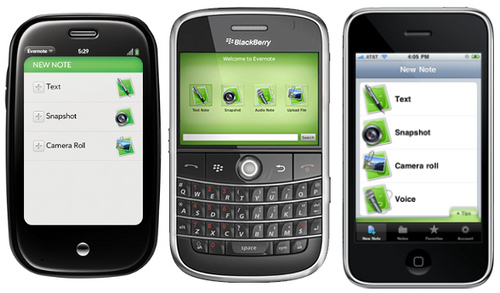

I love Evernote, and I hate it for taking notes. Seriously, the concept is great, but the editor does not fit my needs.

I am not very picky, there are just a few things about Evernote that **need to be fixed**:

- Documents have no semantical structure. There are no sections. Plain text is as intelligent as an Evernote note.
- Outline support. Even headlines would be acceptable.
- Table of contents. Notes get large and messy; scrolling and searching (and not finding) will be unavoidable.
- Export notes. I want to create a spreadsheet whenever I feel like doing so.
- No one needs fonts (at least I never needed them); I just want to write down notes and capture ideas.

Obviously, there are some things Evernote got right:

- Cross-device. Don’t want to take out your laptop? No prob. Just take a note from your iPhone.
- Developer API. There are some awesome 3rd party services built on top of Evernote. Lastly I have discovered [Hello](http://www.evernote.com/hello/) which keeps track of people you meet and automatically syncs to Evernote.
- Voice memos.
- Image scanning

I am feeling so dirty...

I am aware of a premium version, but it doesn’t fix any of the current issues. Awkwaaard. So, I am still waiting for a miracle, (or for a person who joins me on the next Evernote-killer project).

If you know something similar to Evernote tell me about it.

In the next post I will compare Evernote with org-mode, and talk about why it’s so much better, and should be far more popular than Evernote.
