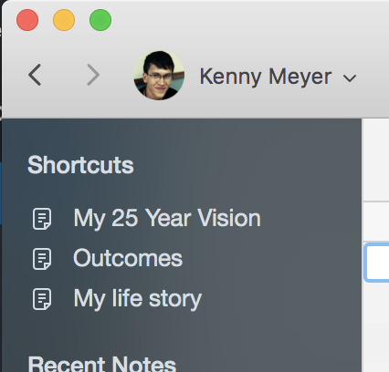

I wrote a post about Evernote ([Why Evernote sucks](https://www.kennymeyer.net/2012/03/15/why-evernote-sucks/)) back in 2012 where I wasn't very happy about it. Fast-forward 5 years later, my life heavily depends on Evernote, and I'm a happy user. Here's why:

- **Life-goal tracking**. I review my 25-year vision every day on my Mac, and update my daily, weekly, monthly and yearly goals on a daily basis.
    
    \[caption id="attachment\_63" align="aligncenter" width="426"\] My Evernote shortcuts\[/caption\]
- **Scanning documents. **I digitalize most of my documents... and when I scan business cards it automatically adds the person to my contact list on my smartphone. Convenient and awesome.
- **Taking notes.** Evernote is still my preferred way to store thoughts about ideas, meetings, projects and things I read on the internet.
- **Evernote Web Clipper****. **This is how I bookmark and archive interesting reads on the internet, so I can later find them when I want to remember something I read in the past, which brings me to...
- **The search function. **This has to be by far the biggest differential. It's all nice and good to be able to store your notes, documents and articles in an application, but finding it is key. Evernote's search features OCR so I can search for text in PDFs I stored a few years ago, and it brings those results up in a matter of milliseconds. No memory can beat that. I can't recall how many hours this feature saved me.
- **Skitch.** The useful little helper that allows me to annotate screenshots and images, to later find them again.

Convinced? Try Evernote [clicking here.](https://www.evernote.com/referral/Registration.action?sig=4841f1fbd43486e1415a5600c9c00a25ac62e43bd1961fa4cd161e2dc82d26aa&uid=15060677)

## Open-source alternatives aren't there yet.

In order for me to use any alternative, they'd need to have that awesome search Evernote has. Believe me, I tried every alternative, and I would pay for them if they'd be able to solve the search problem first with a decent OCR implementation.

## Commercial solutions alternatives aren't there yet.

Apple's Notes app might come in close, but the search is not near as good.

All-in-all I love using Evernote, but the only reason I'm a Premium user is for using the Evernote app on my smartphone. There surely is an opportunity for a good app which focuses on personal power users to get some of that market share...
