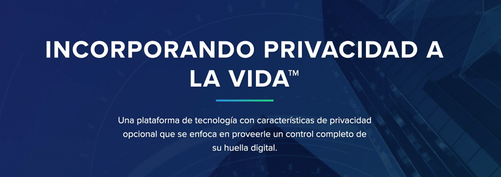
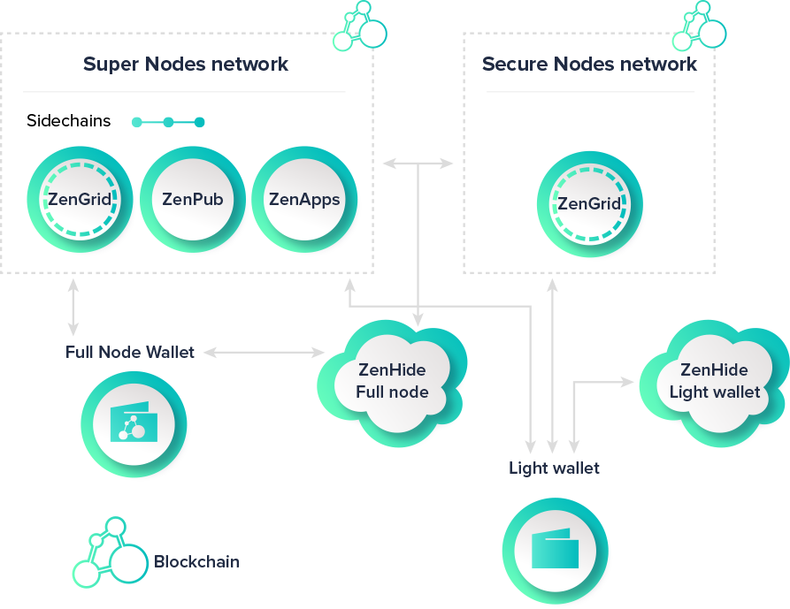

Leé la primera parte de esta seria [aquí](https://www.kennymeyer.net/2019/07/26/mis-ingresos-pasivos-con-criptomonedas-parte-1-crypto-com/). :-)

No me concentraré en la parte especulativa de las criptomonedas, porque eso es algo fuera de mi poder.

Voy enfocarme en transmitir la utilidad que brinda al mundo, que sí es algo más constante, y voy a dar mi experiencia sobre como eso puede generar ingreso pasivo.

**Este artículo no es consejo/sugerencia para invertir tu dinero - yo sólo doy mi experiencia y trato de informar. No tengo ninguna relación comercial con Horizen.**

Antes de explicarte sobre cómo funciona necesito explicarte más.

## ¿Qué es Horizen?

[Horizen](https://www.horizen.global/es/) es una organización que se enfoca en privacidad, con la criptomoneda [ZEN](https://coinmarketcap.com/currencies/zencash/) que tiene su propia blockchain independiente de Bitcoin - nació en el 2017, y su fundadores son Roberto Viglione, un PhD que hizo su tésis sobre Bitcoin antes de que fuera "cool", y Rolf - un ingeniero nuclear.

Hoy en día, Horizen es una organización considerable con muchas cabezas brillantes e importantes lazos con líderes en este ámbito como [IOHK](https://iohk.io/).

Una parte importante del proyecto de Horizen es proveer una infraestructura para correr aplicaciones para personas, empresas e instituciones sin tener que esperar que sea minada cada transacción, eso siendo denominado "Sidechains".

Eso es algo totalmente innovador en el mundo de las criptomonedas, y está previsto a lanzarse más tarde este año.

<iframe src="https://giphy.com/embed/3o8dFn5CXJlCV9ZEsg" width="480" height="360" allowfullscreen></iframe>

[via GIPHY](https://giphy.com/gifs/converse-3o8dFn5CXJlCV9ZEsg)

Esto espero que ayudará a la adopción de blockchain, porque una queja frecuente es la lentitud de las transacciones con aplicaciones descentralizadas, y por ende no ayuda a la adopción masiva.

Los nodos de Horizen son los que habilitarán que se puedan correr programas haciendo uso de la blockchain. Los nodos nada más son computadoras con conexión 24h a la internet y una capacidad de correr una copia del blockchain entero de ZEN y así ayudar a asegurar la red.

Más adelante servirán para ejecutar la función de "Sidechains".

Por ese trabajo que realizan los nodos, la fundación de Horizen provee fondos para que haya incentivos económicos para correrlos. Y es ahí la ganancia.

## ¿Cómo funciona?

Existen dos tipos de nodos con Horizen.

1. Los **secure nodes**
2. Los **super nodes**

Los secure nodes requieren que tengas 42 ZEN mínimo, y los super nodes requieren cómo mínimo 500 ZEN, **guardado en una billetera tuya**.

Esto es algo **maravilloso**. Generalmente tienes que depositar tus criptomonedas en la billetera de otro para obtener beneficios, a cambio con esto vos tenés 100% del control sobre tus criptomonedas.

> **Recuerda nunca darle a nadie tus llaves privadas aunque te lo pida como amigo.** Probablemente no es tu amigo si te los pide.

<iframe src="https://giphy.com/embed/d3mlE7uhX8KFgEmY" width="480" height="264" allowfullscreen></iframe>

[via GIPHY](https://giphy.com/gifs/culture--think-hmm-d3mlE7uhX8KFgEmY)

Una vez que tengas esa cantidad debes transferirlo a una billetera ZEN - te recomiendo usar la aplicación oficial de Horizen: Sphere [https://www.horizen.global/es/spherebyhorizen/](https://www.horizen.global/es/spherebyhorizen/) (para este paso necesitas una computadora)

Una vez hecho eso deberás configurar un supernodo que apunta la dirección pública de billetera - y eso es altamente técnico. Por suerte, existen servicios de terceros que te pueden ayudar con eso.

_Probablemente aquí ya sientes que leíste demasiado, y si es así te recomiendo leer más [sobre nodos en la página oficial](https://www.horizen.global/es/zennodes/) y unirte a mi grupo de WhatsApp para recibir ayuda._ [_https://chat.whatsapp.com/LjZTJr5Gdgi2i2eMvY6dEO_](https://chat.whatsapp.com/LjZTJr5Gdgi2i2eMvY6dEO)

Personalmente estoy operando con [cryptonode.support](https://www.cryptonode.support/) - este sitio provee el servicio de correr un secure node a partir de 2.4 US$ por mes o un supernodo a partir de 10$/mes - y además conozco muy bien al administrador Domenico, teniendo sólo las mejores experiencias con él.

Te contactas con él al email **[administrators@cryptonode.support](administrators@cryptonode.support)** y dices que quieres correr un supernodo/secure node, con la dirección pública y listo.

Cuando cerraste con Domenico el te pasará todos los detalles y empezarás a recibir semanalmente ZEN en tu dirección... mágico!

La cantidad de ZEN a recibir depende de cuántos nodos estén corriendo cada momento, porque se divide los ZEN de forma equitativa entre todos los nodos, lo que significa que cuando más nodos corran, menor el ZEN a recibir, y cuando menos nodos corrán, más ZEN recibirás.

El ROI actual con los secure nodes es de aproximadamente 24%, lo que quiere decir que tus 42 ZEN en un lapso de 12 meses se convertirán en 52 aproximadamente.

El ROI actual con los super nodes es de aproximadamente 17%, lo que quiere decir que tus 500 ZEN en un lapso de 12 meses se convertirán en 585 aproximadamente.

## ¿Vale la pena?

No quiero convencer a nadie poner su dinero en algo sin hacerlo de forma informada.

Actualmente Horizen tiene una de las redes más grandes de nodos compitiendo con Bitcoin.

Antes de comprar ZEN recomiendo informarte bien - el valor del ZEN con respecto al dólar puede cambiar significativamente, pero yo aún considero que es una buena oportunidad por la trayectoria y calidad del equipo, el tamaño de la visión y la ejecución.

## ¿Cómo puedo comprar ZEN?

Actualmente puedes comprar ZEN en Binance ([clic aquí](https://www.binance.com/en/markets?ref=10932357)) y otros mercados como Bittrex.

_Si necesitas ayuda con esto, no dudes en unirte a mi grupo de WhatsApp para ayudarte:_ [_https://chat.whatsapp.com/LjZTJr5Gdgi2i2eMvY6dEO_](https://chat.whatsapp.com/LjZTJr5Gdgi2i2eMvY6dEO)

## Conclusión

Es una inversión de mediano riesgo, en una parte segura porque no depositas las criptomonedas en la billetera de otra persona, pero por otra parte no podemos controlar el precio del ZEN con respecto al dólar.

Existen varias criptomonedas que proveen retornos similares para correr "nodos" solo que la mayoría no tienen utilidad real. Mucho cuidado.

Muchas gracias por leer mi artículo. Hasta la parte 3.
